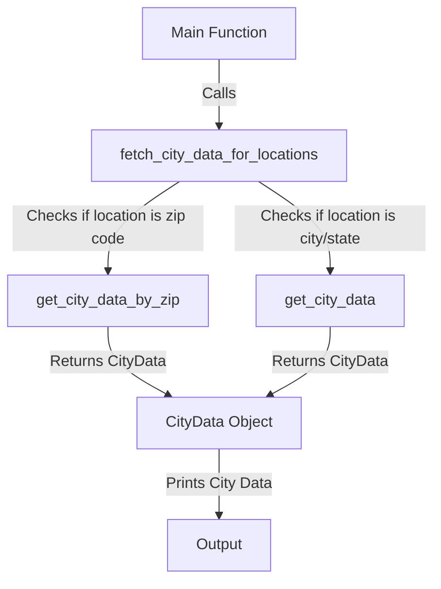

# City Data Fetcher

This project is a Python application that fetches city data for specified locations using the OpenWeatherMap API. It supports querying by city/state or zip code and returns relevant geographical information.

## Features

- Fetch city data based on city and state.
- Fetch city data based on zip code.
- Handle multiple locations in a single request.
- Return structured data using the `CityData` class.

## Requirements

- Python 3.x

## Installation

1. Clone the repository:

   ```bash
   git clone https://github.com/vinayaka-suryanarayana/ubiquitous-invention.git
   cd ubiquitous-invention
   ```

2. Create a virtual environment (optional but recommended):

   ```bash
   python -m venv venv
   ```

3. Activate the virtual environment:

   - For **Linux/Mac**:
     ```bash
     source venv/bin/activate
     ```
   - For **Windows**:
     ```bash
     venv\Scripts\activate
     ```

4. Install the required packages from `requirements.txt`:

   ```bash
   pip install -r requirements.txt
   ```

## API Key

You need to replace the `API_KEY` in `geoloc_util.py` with your own OpenWeatherMap API key for the application to run properly. You can sign up for a free account at [OpenWeatherMap](https://openweathermap.org/) to obtain your API key.

To update the API key, open `fetching/geoloc_util.py` and modify the following line:

```python
API_KEY = "your_api_key_here"
```

Replace `"your_api_key_here"` with your actual API key.

## Usage

To fetch city data for specified locations, run the following command:

```bash
python -m geoloc_util --locations "City, State" "Zip Code"
```

### Example

```bash
python -m geoloc_util --locations "Los Angeles, CA" "98115"
```

This command will return the city data for Los Angeles, CA, and the zip code 98115.

## Function Call Flow



## Testing

To run the tests, use the following command:

```bash
pytest test_geoloc_util.py -v
```
